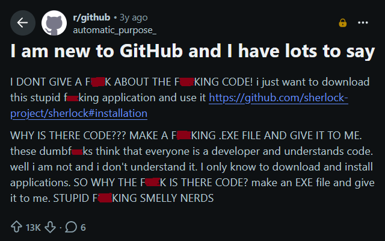
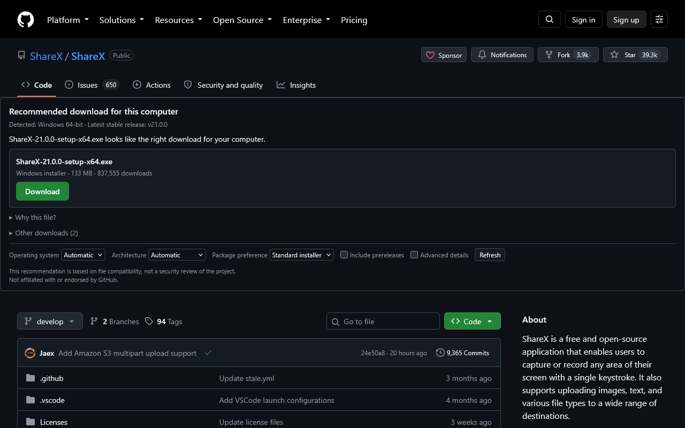

# Where's the Damn Download?

A browser extension for people who were sent to a GitHub repository to
"download the program" and found a wall of files named
`MyApp-4.2.1-x86_64-pc-windows-msvc.zip`.



On a repository's page it detects your operating system and processor, reads
the repository's GitHub Releases, and points at the file you most likely need:

> **Recommended download for this computer**
> Detected: Windows 64-bit · Latest stable release: v4.2.1
> **MyApp-4.2.1-setup-win64.exe** — Windows installer · 84.2 MB
> **Download** · Why this file? · Other downloads

It may also say "there is no ready-to-run Windows build here", or "this repository doesn't publish releases". The recommendation is about file
compatibility, not a security review of the project.



More: [every file with its own reason](docs/screenshot-other-downloads.png), and
[a repository with nothing to download](docs/screenshot-no-releases.png).
`npm run shots` regenerates them.

## Browsers and platforms

- Chrome and Chromium browsers (Manifest V3, service worker).
- Firefox desktop 140+ (Manifest V3, event page).
- Firefox for Android 142+ (the same build).
- Windows is fully supported (x64, ARM64, 32-bit, installer vs portable
  preference, overrides). macOS and Linux have baseline rules and fixtures;
  claims there stay conservative.

## Using it

Visit any public repository on github.com. The panel appears above the
repository content on the home page, the releases list, and individual release
pages. Open **Other downloads** to see every file with a one-line reason, and
tick **Advanced details** for the classifier's evidence. Overrides for OS,
architecture and package preference live in the panel and on the options page
(click the toolbar icon).

Nothing is downloaded until you click the link yourself.

## Build environment

This is built on Windows 11 with Node 24.18.1 and npm 11.16.0. The build is
platform-independent and the default reviewer environment (Ubuntu 24.04.4 LTS,
ARM64, Node 24.14.0, npm 11.9.0) works unchanged: `package-lock.json` carries
all 26 `@esbuild/*` platform packages, `linux-arm64` among them, so `npm ci`
resolves the right binary there.

```sh
npm ci
npm run build
```

The Firefox output is `dist/firefox`, and it is byte for byte what the uploaded
ZIP contains. esbuild bundles and transpiles the TypeScript in `src/` to plain
JavaScript; nothing is minified and no source maps are emitted.

One trap: **there is no `manifest.json` in this repository.** The checked-in
file is `manifest.src.json`, and `tools/build.mjs` generates each browser's
manifest from it during the build.

## Development

```sh
npm ci
npm test            # vitest: classifier fixtures, API mocks, jsdom UI
npm run test:watch  # the same suite, watching
npm run typecheck   # tsc --noEmit
npm run build       # dist/firefox and dist/chrome
npm run build:dev   # same, with __DEV__ logging and inline source maps
npm run lint        # web-ext lint on the Firefox build
npm run package     # zips for both stores in web-ext-artifacts/
npm start           # Firefox with the extension loaded, on a repo with releases
npm start -- --chrome   # same in Chrome/Chromium
npm start -- --fresh    # throwaway profile instead of .dev-profile/
npm run icons       # regenerate icons/ and docs/store-icon-128.png (the Chrome listing icon)
npm run probe -- owner/repo [--save]   # classify a repo's latest release; --save snapshots it as a real-world fixture
```

`npm run build` (`tools/build.mjs`) runs esbuild over the TypeScript in `src/`:
the three entry points are bundled and transpiled into plain JavaScript under
`dist/firefox` and `dist/chrome`, and the manifest is derived from
`manifest.src.json` per browser. Nothing is minified and only `build:dev` emits
source maps, so the shipped files read close to the source — which matters if
you are reviewing a store upload.

`npm start` (`tools/dev.mjs`) makes a dev build, opens the browser with a
persistent profile under `.dev-profile/` so the GitHub login and the
extension's settings survive between launches, and rebuilds on every change
to `src/`, `icons/` or `manifest.src.json`; web-ext then reloads the
extension. Any other flag is passed to `web-ext run` (`--devtools`, for one).

To load a build by hand instead: Chrome → `chrome://extensions` → Developer
mode → Load unpacked → `dist/chrome`. Firefox →
`about:debugging#/runtime/this-firefox` → Load Temporary Add-on →
`dist/firefox/manifest.json`.

## Layout

- `src/domain` — the pure classifier. No browser, no network, no clock.
  See [CLASSIFIER.md](CLASSIFIER.md).
- `src/github` — URL parsing, API client, response validation.
- `src/storage` — settings (sync) and release cache (local).
- `src/background` — the only place that talks to api.github.com.
- `src/content`, `src/ui` — page detection, navigation survival, the panel.
- `tests/` — Vitest suites; fixtures in `tests/fixtures/`.
- `tools/build.mjs` — esbuild + manifest derivation. See
  [ARCHITECTURE.md](ARCHITECTURE.md).

## Limitations (1.0)

- Public repositories on github.com only. No GitHub Enterprise, no private
  repositories, no authentication.
- Unauthenticated GitHub API: 60 requests per hour per IP. The cache keeps
  ordinary browsing well under that; a "limit reached" state appears otherwise.
- Architecture detection reports the browser's architecture. An x64 browser on
  an ARM machine (Rosetta, Windows on ARM) reads as x64 — use the override.
- Release notes are not shown.

## Contributing

[CONTRIBUTING.md](CONTRIBUTING.md) has the promises that decide what belongs
here, how to add a classifier rule, and where things live. The short version:
add a failing fixture before changing a rule (asset cases in `tests/*.test.ts`,
whole releases in `tests/fixtures/repository-cases/`), keep weights in
`src/domain/rules.ts` and copy in `src/ui/strings.ts`, and run
`npm test && npm run typecheck && npm run build && npm run lint` before opening
a pull request.

## Privacy and licence

See [PRIVACY.md](PRIVACY.md). Licensed under the MPL-2.0. Not affiliated with
or endorsed by GitHub.
